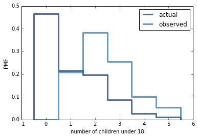

[Think Stats Chapter 3 Exercise 1](http://greenteapress.com/thinkstats2/html/thinkstats2004.html#toc31) (actual vs. biased)
Python code for producing the actual and biased probability mass functions for the respondent variable "number of children under 18 in the house hold" is given below.
```python
from __future__ import print_function

import thinkstats2
import math
import numpy
import thinkplot

def ReadRespData(dct_file='2002FemResp.dct',
                dat_file='2002FemResp.dat.gz'):
    dct = thinkstats2.ReadStataDct(dct_file)
    df = dct.ReadFixedWidth(dat_file, compression='gzip')
    return df
    
dataset = ReadRespData()
actual_pmf = thinkstats2.Pmf(dataset.numkdhh, label = 'actual')

def BiasPmf(pmf, label):
    new_pmf = pmf.Copy(label=label)
    for x, p in pmf.Items():
        new_pmf.Mult(x, x)
        
    new_pmf.Normalize()
    return new_pmf

biased_pmf = BiasPmf(actual_pmf, label='observed')

thinkplot.PrePlot(2)
thinkplot.Pmfs([actual_pmf, biased_pmf])
thinkplot.Show(xlabel='number of children under 18', ylabel='PMF')

print('Mean of the biased distribution:' + str(biased_pmf.Mean()))
print('Mean of the actual distribution:' + str(actual_pmf.Mean()))
```
It produced the following print-out:  


```
Mean of the biased distribution:2.40367910066
Mean of the actual distribution:1.02420515504
```
The means and the two pmf illustrate that when surveying children of households, the resulting distribution is biased towards larger households.
