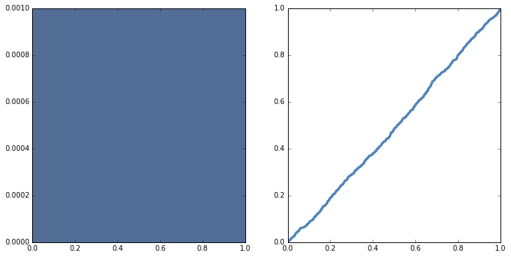

[Think Stats Chapter 4 Exercise 2](http://greenteapress.com/thinkstats2/html/thinkstats2005.html#toc41) (a random distribution)

Python code for producing the PMF and CDF for the randomly generated dataset are given below.
```python
import thinkstats2
import math
import numpy as np
import thinkplot

sample = np.random.random(size = 1000)
pmf = thinkstats2.Pmf(sample)
cdf = thinkstats2.Cdf(sample)

thinkplot.PrePlot(2, cols=2)
thinkplot.Pmf(pmf)
thinkplot.Config(ylabel = 'PMF')
thinkplot.PrePlot(2)
thinkplot.SubPlot(2)
thinkplot.Cdf(cdf)
thinkplot.Show(ylabel = 'CDF')
```
It produced the following print-out:  



The PMF for a uniform random distribution should be y = 1 for x in the range [0,1]. The CDF for a uniform random distribution is y = x for x in the range [0,1]. The plot output from the program above shows that the generated sample of 1000 numbers were indeed drawn from a uniform random distribution.
